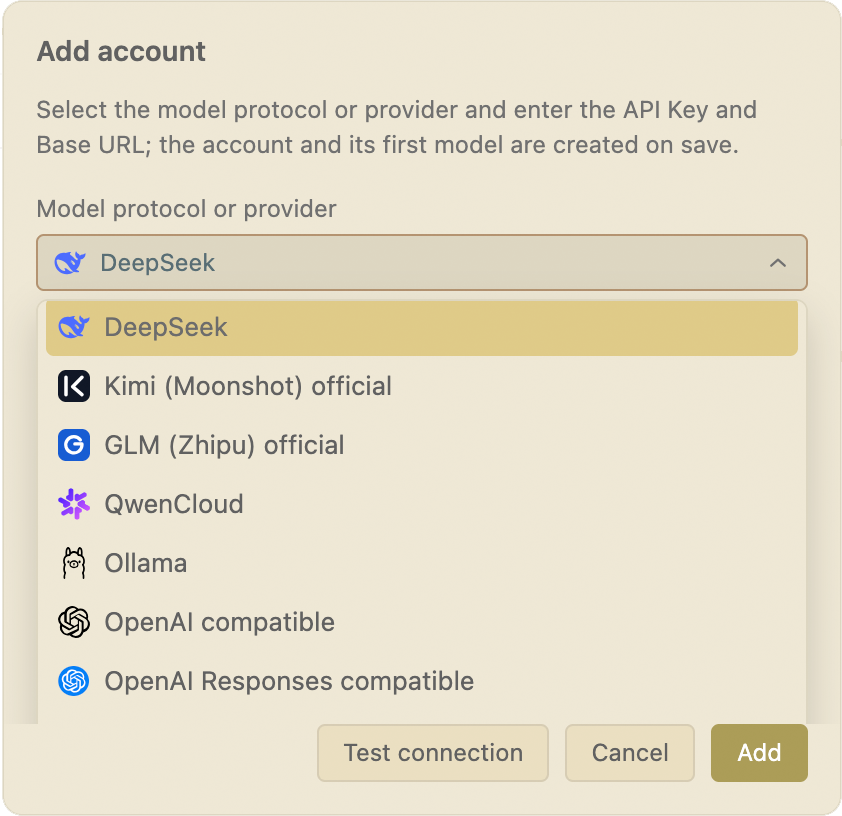

> **中文：[README.md](./README.md) | English: this document**


# KeepSeek: Use Your AI Models Freely from One VS Code Sidebar

> **Multiple accounts · Multiple providers · Native protocols · Cache optimization · Cursor-like workflow**

KeepSeek is an open-source coding agent for VS Code. It does not lock your workflow to a single model provider. Official DeepSeek, Kimi, GLM, and QwenCloud accounts; OpenAI Chat Completions / Responses-compatible services; Anthropic Messages-compatible services; and local Ollama can all live side by side as independent accounts, managed in one place and switched whenever you need.

Models can change without forcing your workflow to change. KeepSeek brings Cursor-like context interactions, long-session cache optimization, professional read-only code exploration, and review-before-apply DraftEdits into the VS Code you already know.

- **Keep multiple accounts connected**: configure personal, team, proxy, and local accounts separately, with multiple models under each account;
- **Use three independent protocol lanes**: Chat Completions, OpenAI Responses, and Anthropic Messages each have native streaming behavior instead of being forced into one format;
- **Get first-class DeepSeek support**: official connectivity, model discovery, Thinking, tool calls, balance / usage, and prefix-cache diagnostics work as one experience;
- **Make long sessions efficient**: stable request prefixes, append-only history, controlled compaction, and per-session frozen tool schemas reduce repeated tokens and cache invalidation;
- **Keep the Cursor-like feel**: sidebar chat, right-click selections, shortcut references, file / directory drag-and-drop, and terminal or debug-log references;
- **Stay in control of every edit**: the agent only creates DraftEdits; files change only after you review the diff and click Apply.

**Open source · MIT License · [GitHub](https://github.com/kmvdata/keepseek)**

---

## 1. Multiple Accounts and Providers: Put Model Choice Back in Your Hands

One coding workflow should not mean a permanent commitment to one model subscription. KeepSeek treats an account as the basic model connection: each account independently stores its provider / API protocol, API key, base URL, and model list. You can add several accounts for the same provider and attach several models to each account.



Keep official accounts, company gateways, low-cost compatible services, and local Ollama together, then pick the right one for each task: a lightweight model for quick questions, a stronger reasoning model for a difficult refactor, or a local model for sensitive code. Chat, context references, and safety confirmations stay exactly where you expect them.

### Supported providers and API types

| Provider / API type | Request lane | Best fit and highlights |
|---|---|---|
| **Official DeepSeek** | Chat Completions (first-class adapter) | Official model discovery, Thinking, tool calls, balance / usage, and prefix-cache diagnostics |
| **Official Kimi** | Chat Completions | Official endpoint, model discovery, and streaming agent calls |
| **Official GLM** | Chat Completions | Official endpoint, model discovery, and tool calls |
| **QwenCloud** | Chat Completions compatible | Alibaba Cloud-compatible endpoint and model management |
| **OpenAI compatible** | Chat Completions | OpenAI, third-party gateways, proxies, and self-hosted compatible services |
| **OpenAI Responses compatible** | Responses API | Native Responses input items, function calls, and reasoning replay |
| **Anthropic compatible** | Messages API | Native Messages content blocks, Thinking / signatures, and tool replay |
| **Ollama** | Local Chat Completions | Local service by default, with API-key-free local models supported |

If a compatible endpoint does not expose a model list, that is fine: KeepSeek retains the last successful cache, and you can manually add a model ID, context window, and maximum output budget.

### Native protocols, not compatibility theater

KeepSeek maintains three separate request and streaming-parser lanes internally:

- **Chat Completions** for DeepSeek, Kimi, GLM, QwenCloud, Ollama, and general OpenAI-compatible endpoints;
- **OpenAI Responses**, preserving native input items, function-call outputs, and reasoning replay;
- **Anthropic Messages**, using the correct authentication and request fields while preserving the order of Thinking, signatures, redacted data, `tool_use`, and `tool_result` blocks.

Provider-native state can be replayed faithfully when a conversation continues within the same protocol, account, and endpoint. When you switch across accounts or protocols, visible conversation text remains available, and KeepSeek surfaces the boundary where native tool or reasoning blocks cannot migrate losslessly instead of pretending they can.

### Account switching should be simple—and dependable

- The model menu aggregates every account and groups models by account. Once selected, both chat and summary requests use that model's account credentials;
- Connections with the same protocol, API key, and base URL reuse the existing account instead of storing duplicate credentials;
- A failed model refresh keeps the local cache and never blocks the current conversation;
- Credentials live only in VS Code extension global storage, never in the workspace or Git;
- Legacy `keepseek.apiKey`, `keepseek.baseUrl`, and `DEEPSEEK_API_KEY` values are no longer read. Configure connections in KeepSeek's account manager.

---

## 2. First-Class DeepSeek and Cache Optimization: A Strength, Not a Constraint

KeepSeek is no longer defined by DeepSeek alone, but its official DeepSeek experience still goes deep: a dedicated official source, model discovery, streamed Thinking, tool calls, account balance, usage and cost information, and provider-reported cache-hit data all work through one interface.

More importantly, KeepSeek treats sustained cache hits as product behavior rather than luck. In a long agent conversation, system instructions, tool definitions, and history recur in every request. If their bytes drift from turn to turn, input tokens are repeatedly spent. KeepSeek uses one cache-friendly foundation for DeepSeek prefix caching and other providers' prompt caches.

### Four cache-friendly principles

1. **Byte-stable request prefixes**: the static system section contains no timestamps, random IDs, or transient state; project instructions, Skills, and formatted context are persisted and reused per session.
2. **Append-only history**: sent user and assistant messages are persisted as-is, and projections stay append-only whenever possible instead of trimming, reordering, or rewriting the middle of a hot conversation.
3. **Tool schemas frozen per session**: the tool set and ordering stay stable across turns; when tools must be disabled, protocol controls are used instead of deleting the entire tools section.
4. **Compaction as a controlled reset point**: long-session summaries refresh infrequently and never block the main request on failure. Hot caches are preserved until cold recovery, unavoidable compaction, or a protocol-lane switch makes a reset necessary.

For official DeepSeek, this directly improves the stability of multi-turn prefix reuse. For official Anthropic endpoints, KeepSeek uses the corresponding Prompt Caching semantics. For other compatible services, KeepSeek trusts real usage / cache data returned by the provider and never invents hit rates or costs.

> Cache-friendly is not a slogan. Byte-stability and protocol-projection tests guard these constraints so an ordinary change cannot silently make long sessions expensive.

### Context compaction: reduce volume as well as unit cost

Caching reduces the cost of repeated input; compaction reduces the size of the context itself. KeepSeek does not simply dump the full transcript into every request. A shared history projection organizes model input instead:

- Summaries retain goals, decisions, errors, file paths, line ranges, function names, completed work, and remaining tasks;
- Large file bodies, logs, and code blocks expanded earlier are not carried forever on every turn;
- When details are needed, the model re-reads the current file through read-only tools instead of relying on stale code;
- The first requirement, latest input, user corrections, important errors / test failures, and DraftEdit results are protected;
- Auto-compaction offers **70% early cleanup, 80% balanced, and 85% cache-first** tiers, persisted per workspace.

The result: a long conversation can keep accumulating useful context without token usage growing without bound alongside the turn count.

### Visible usage and cache health

- Usage is attributed to an **account + model** first, then split into main requests, summaries, retries, continuations, and background work;
- The actual request, token estimate, context-window guard, compaction decision, and UI all share the same provider projection;
- Pricing or balance is shown when a provider offers reliable support; otherwise KeepSeek clearly says “Cost unavailable”;
- Per-run details can record real provider-reported cache-hit / miss tokens, hit rate, and data availability;
- Cache diagnostics surface likely causes when the protocol, account, endpoint, system prompt, tool schema, or history projection changes.

---

## 3. Keep the Cursor-Like Feel Without Leaving VS Code

KeepSeek lives in the VS Code sidebar. You can inspect code and hand the model only the context it needs without switching windows or shuttling text between your editor and a chat box.

### Context: only what you choose

- **Editor selections**: right-click or press `Cmd+L` / `Ctrl+Shift+L`, preserving file path, line, and column;
- **Files and directories**: add them from the Explorer context menu or drag them into the input box as reference chips;
- **Live runtime context**: selected terminal, Output panel, and Debug Console text can join as log references;
- **Precise line ranges**: use `<path#L10-L20>` to expand only the relevant section, not the whole file;
- **External content**: files outside the workspace require authorization before entering context.

### More than chat: a code-reading toolkit

- Declaration and reference lookup prefers VS Code language services, giving more accurate navigation with fewer tokens than repeatedly sending whole files;
- Workspace text search, directory listing, and line-range reads are all read-only and stay inside the workspace;
- Dependency, build, and VCS directories are skipped automatically; binary, media, archive, and oversized files never enter context;
- Git support is read-only—branch, status, diff, patch, and commit-message suggestions, but never push or automatic commit;
- Models re-read current files on demand, so they see the code you just changed rather than a copy from several turns ago.

As AI writes code faster, KeepSeek helps you retain control of architecture, dependencies, and change boundaries: let the model work while keeping the full picture visible to the human responsible for it.

When the work piles up, let the AI learn to delegate. KeepSeek supports an isolated “main model + subagents” mode: the main model can hand independent investigations, reviews, or proposed edits to several restricted subagents running in parallel. Each subagent starts with one focused task and returns only a distilled result—its intermediate reasoning and tool traces stay in an isolated session instead of flooding the main context. The payoff: long conversations spend fewer tokens, finish faster, and the main model keeps its attention on the hard problems. Subagent models can be pinned globally in the account manager and follow the main model by default; everything subagents propose still passes through your review before Apply, so the safety boundary never moves. See [SUBAGENTS.md](SUBAGENTS.md) for architecture, safety boundaries, and profile formats.

---

## 4. Safe Edits: The Agent Proposes, You Decide

KeepSeek separates “can understand the code” from “can write directly to disk”:

- **No silent writes**: create / modify / delete operations can only create a DraftEdit inside a ChangeSet;
- **Review the diff before Apply**: choose Apply, Discard, or Revert; disk changes only after you click Apply;
- **Double confirmation for deletion**: high-risk tool authorization and a dedicated pre-Apply deletion confirmation are both required;
- **Protection against overwriting new content**: if a file changes after the draft is created, deletion or dangerous writes are refused;
- **Dirty-editor protection**: unsaved editor contents are never overwritten in the background;
- **Read-only boundaries**: agent exploration stays inside the workspace, and external files require explicit authorization.

That extra confirmation is not friction. It keeps the final decision where it belongs.

---

## 5. Agent Capabilities for Real Engineering Work

### Skills and project instructions

KeepSeek discovers Codex-compatible Skills in workspace `.agents` directories and `~/.codex/skills`. Browse them with `/skills`, invoke them with `$`, or draft one with `/create-skill`. Project `AGENTS.md`, activated Skills, and context files enter the session through a shared budget and deduplication pipeline. Scripts inside a Skill are identified but never executed automatically.

### Long tasks and session management

- Stop reasoning or a tool loop at any time;
- Retry recoverable pre-first-chunk failures with exponential backoff;
- Save sessions per project, with bookmarks, rename, filters, copy-to-current-project, and batch deletion;
- Serialize background work per session so history and cache prefixes are not rewritten concurrently;
- Check the target context window and native replay boundary when switching models, with a local confirmation when needed.

### Controlled validation and repair

The agent can only run fixed `compile` / `lint` / `test` validation. On failure it reads Problems, prepares a repair DraftEdit, and waits for your confirmation. It cannot start another validation round before the repair is applied.

---

## 6. Who KeepSeek Is For

- **People using several model services** who want to compare quality, speed, and cost without maintaining several plugin workflows;
- **BYOK users and teams** who need clean separation between personal accounts, team gateways, proxies, and local models;
- **Official DeepSeek users** who want native Thinking, balance / usage, and cache optimization without giving up the freedom to switch later;
- **OpenAI Responses / Anthropic Messages users** who care about faithful native tool and reasoning replay instead of lossy protocol conversion;
- **Local-model users** who want Ollama and cloud models in the same VS Code entry point;
- **Heavy agent users** with long conversations and large file or log contexts who care about tokens, caching, and context health;
- **Architecture owners, reviewers, and new team members** who need semantic navigation, read-only exploration, and reviewable edits to understand the whole project.

---

## 7. Quick Start

```bash
# 1. Build and install a local VSIX
bun run package
code --install-extension keepseek-<version>.vsix

# Or package, uninstall the old build, and install the new one in one command
bun run reinstall:vsix
```

```text
# 2. Open it in VS Code
KeepSeek: Open Chat
```

```text
# 3. Open KeepSeek's account manager
Choose DeepSeek / Kimi / GLM / QwenCloud / Ollama / OpenAI compatible /
OpenAI Responses compatible / Anthropic compatible, enter the API key and base URL, then add a model.
```

Select some code and press `Cmd+L` / `Ctrl+Shift+L` (or right-click to add it to KeepSeek), then start your first conversation. When you switch accounts or models later, there is no new interaction model to learn.

---

## 8. Common Configuration

| Setting | Default | Purpose |
|---|---:|---|
| `keepseek.selectedSourceId` + `keepseek.selectedModelId` | `""` | Persist the selected account source and model per workspace |
| `keepseek.thinkingEnabled` | `true` | Enable Thinking for models that support it |
| `keepseek.reasoningEffort` | `high` | Thinking effort: `high` / `max`, adapted to model capabilities |
| `keepseek.compressionThreshold` | `balanced` | `aggressive` 70% / `balanced` 80% / `cache` 85% |
| `keepseek.slimToolModeEnabled` | `false` | Smaller dynamic tool set; off by default to keep the tool schema stable |
| `keepseek.promptCacheTtlMinutes` | `1440` | Conservative cold boundary for provider prompt caches |
| `keepseek.maxFileBytes` | `200000` | Maximum bytes read from one referenced or workspace text file |
| `keepseek.maxWorkspaceToolFiles` | `2000` | Maximum candidate files enumerated by read-only listing and search |
| `keepseek.context.totalBudgetTokens` | `32000` | Shared budget for project instructions, Skills, Memory, and context files |

---

## 9. Maintainer Commands

```bash
bun run compile
bun run lint
bun run build:test
bun run test
bun run package:market
```

Use `bun run package:market` for release packaging. It cleans and recompiles, packages runtime dependencies, and verifies the VSIX dependencies and entry point. Do not run bare `npx vsce package --no-dependencies`.

---

## 10. Further Reading

- [Cache-hit optimization](./doc/cache_keepseek.md)
- [Agent runtime workflow](./doc/keepseek-agent-runtime-workflow.md)
- [API payload reference](./doc/keepseek-api-payload-reference.md)
- [File reference specification](./doc/keepseek-file-reference-spec.md)
- [Source code](https://github.com/kmvdata/keepseek)

---

## Acknowledgments

KeepSeek's early context and cache design was inspired in part by **Reasonix**. Our thanks to the project.

---

*KeepSeek in one line: an open-source VS Code sidebar coding agent for multiple accounts and providers, with first-class DeepSeek, OpenAI Responses and Anthropic Messages support, cache-aware long conversations, Cursor-like context interactions, and review-before-apply edits.*
