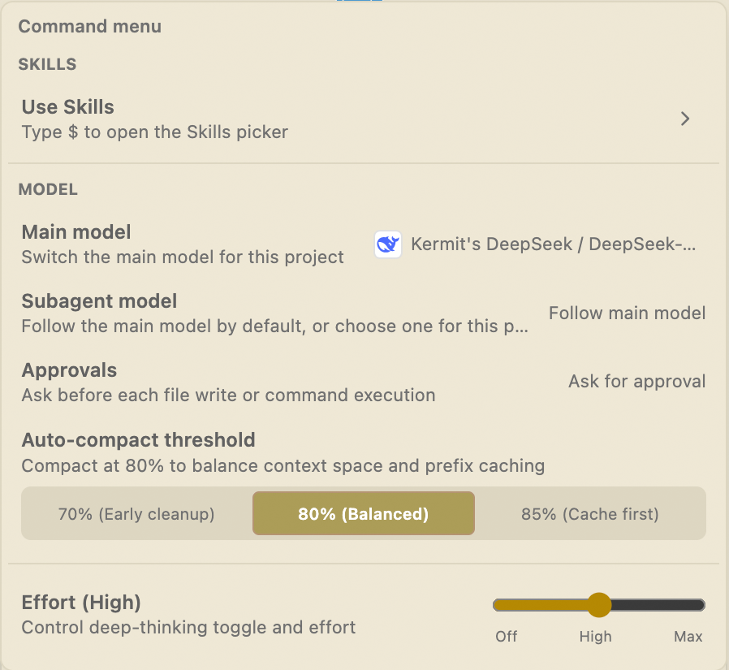
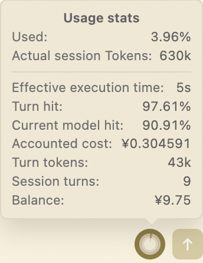
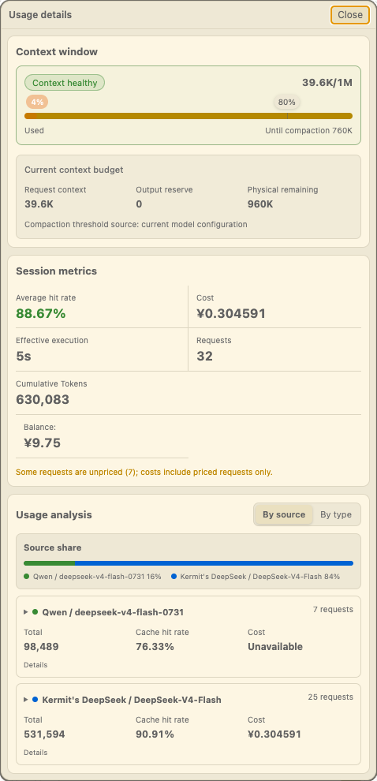

> **English: This document | 中文：[README.md](./README.md)**

<p align="center">
  
</p>

# KeepSeek

## 1. Turn the Model You Choose into an Agent That Gets Real Work Done

**KeepSeek is an open-source coding agent in the VS Code sidebar: you choose the models, control the context, and decide how edits and commands are approved.**

It brings AI services, project context, code exploration, file editing, and command execution into one workflow. There is no need to shuttle content between your browser, terminal, and editor—or learn a different tool every time you switch models.

KeepSeek’s practical value comes down to five things:

- **No provider lock-in**: connect DeepSeek, Kimi, GLM, QwenCloud, OpenAI- and Anthropic-compatible services, and local Ollama at the same time, then switch by task;
- **Understands the project you are working on**: selections, files, directories, terminal output, and debug logs can become conversation context, while the agent can search and re-read code as needed;
- **Takes action without overstepping**: you see a diff before an edit and the full command before execution; the active approval mode determines whether each action proceeds;
- **Built for long tasks**: project-scoped sessions, Skills, subagent collaboration, context compaction, and usage statistics help complex work keep moving.
- **Fast to start, cheap to run**: an empty session is ready immediately on cold start and common settings are available from the first second; context estimates are cached and prompt-cache hit rates stay high, so long conversations use fewer tokens and cost less;

If you want to keep control of your APIs, models, and costs while gaining a complete agent workflow inside VS Code, KeepSeek is built for you.

**Open source · MIT License · [GitHub](https://github.com/kmvdata/keepseek)**

---

## 2. From Connecting a Model to Completing a Task

### 1. Manage Every Model from One Place

KeepSeek manages model connections as accounts. Personal accounts, team gateways, third-party compatible services, and local models stay separate, and each account can contain multiple models. Switching models does not change how you chat, attach context, or approve actions.


KeepSeek currently supports official DeepSeek, Kimi, GLM, and QwenCloud accounts; OpenAI Chat Completions- and Responses-compatible services; Anthropic Messages-compatible services; and local Ollama. Each protocol handles streaming responses, tool calls, and reasoning content independently. You can also add models manually when a compatible endpoint does not provide a model list.

API keys are stored only in VS Code extension global storage. They are never written to the workspace or Git.

Alongside the account system, KeepSeek adds several model-management conveniences:

- **Global default model**: mark any available model as the default; it is used whenever you do not choose explicitly and stays consistent across workspaces. If the default model becomes unavailable, it is cleared automatically instead of silently stalling your task;
- **Model aliases**: give accounts or models custom names so they are instantly recognizable when switching;
- **Per-model tuning**: set a separate context window and max output for each model (compact K/M token notation), and control whether a model appears in the picker;
- **Switch while generating**: queue a model switch while waiting for a reply—only your last selection takes effect; background tasks keep the model they started with and never change lanes mid-flight.

### 2. Give AI Only the Context That Matters

KeepSeek lives in the Secondary Sidebar. Open `KeepSeek: Open Chat`, choose an account and model, and start working directly with the current project:

- Select code in the editor and add it through the context menu or with `Cmd+L` / `Ctrl+Shift+L`; on first launch KeepSeek fills in any missing shortcuts for you (user-level keybindings.json), so there is nothing to configure;
- Add files or directories from Explorer, or drag them straight into the input box;
- Reference runtime information from the terminal, Output panel, or Debug Console;
- Use `<path#L10-L20>` to include only the lines you need;
- Let the agent use read-only tools to search text, inspect directories, find declarations and references, and read Git status and diffs.

When the model needs details, it re-reads the current file instead of relying indefinitely on code from several turns ago. Files outside the workspace require authorization first, while binary, media, archive, and oversized content is not read as text context.

A project-level `AGENTS.md` can define persistent development rules, while Codex-compatible Skills package workflows for specific tasks. Browse Skills from the command menu, or type `$` in the input box to open the Skills picker.

### 3. Let the Agent Edit and Validate Within Clear Boundaries

KeepSeek separates proposing an action from carrying it out:

- File creation, modification, and deletion first become pending changes; inspect the diff, then choose Apply, Discard, or Revert;
- Arbitrary commands first become complete run proposals that show the executable, arguments, working directory, environment, and risks;
- Deletion, file conflicts, unsaved editors, and untrusted workspaces receive additional protection;
- Built-in validation is limited to the configured `compile`, `lint`, and `test` tasks. After a failure, the agent can prepare a fix for another review.

The agent can therefore complete real engineering work without silently changing files or running commands out of sight.

Larger workloads stay just as controllable:

- **Batched command execution**: pending commands proposed in one turn can be grouped into a batch, approved once, run in order with per-command progress, and stopped at any time. Approvals automatically expire when the session, approval mode, or workspace trust changes;
- **Auto-continue after budget exhaustion**: when a foreground task hits the tool-turn or step limit, KeepSeek starts a new round to finish outstanding work—but only when there is real progress to show (up to 8 rounds by default, configurable). Edits still need individual approval;
- **Surgical edits in huge files**: oversized files are handled with resumable range reads and precise incremental edits, so every change stays visible and reviewable.

### 4. Control the Current Task from the Command Menu

Click the **`/` button** below the input box to open the command menu. From here, you can launch Skills, switch the main and subagent models, adjust the approval mode and auto-compaction threshold, and control Thinking effort.

<p align="center">
  
</p>

There are three approval modes:

- **Ask for approval** (default): you confirm every file write and command before it runs;
- **Model review**: an isolated, tool-free subagent model reviews each action. This is suited to long-running tasks, and the reviewer can deny risky actions;
- **Auto approve**: KeepSeek handles the current task under your delegation without model review. It is the fastest mode and carries the highest risk.

Auto approve does not disable workspace-trust, file-conflict, or dirty-editor safeguards. You can stop the task at any time or switch back to Ask for approval to cancel subsequent automatic actions.

### 5. Keep Long Tasks Moving—and Keep Costs Visible

Sessions are saved by project and can be bookmarked, renamed, filtered, or copied. For complex work, restricted subagents can investigate, review, or prepare edit proposals in parallel. Their intermediate work stays isolated, only distilled results return to the main session, and final changes retain the same review boundaries. See [SUBAGENTS.md](SUBAGENTS.md) for details.

Long sessions compact older context while preserving important goals, decisions, errors, and remaining work, and KeepSeek tries to retain prompt-cache hits along the way. Choose early cleanup, balanced, or cache-first behavior without calculating the remaining context space yourself.

Hover over the usage indicator below the input box for an at-a-glance view of context use, session tokens, cache hit rates, cost, turns, and balance:

<p align="center">
  
</p>

Click the indicator to open Usage details, where you can inspect the context window, compaction point, session metrics, and usage broken down by account, model, request source, or type:

<p align="center">
  
</p>

When a provider can reliably return pricing, balance, or cache data, KeepSeek displays it as reported. When data is unavailable, the UI says so instead of presenting an estimate as a precise result.

Performance starts from the first second VS Code opens: an empty session is ready on cold start, and main model, subagent model, approval mode, and other settings are available right away. Stable inputs reuse cached context-estimation results, so the usage display is faster and cheaper to compute, and concurrent windows can write without interfering with one another. Combined with the per-session frozen protocol and tool schema, multi-turn conversations keep higher prompt-cache hit rates—so long tasks cost less in practice.

---

## 3. Development, Packaging, and Project Resources

### Local Development

The project requires VS Code `^1.98.0`. Common development commands run through Bun:

```bash
bun install
bun run compile
```

Open the repository in VS Code and press `F5` to launch an Extension Development Host. After changing the source, run the following checks:

```bash
bun run lint
bun run build:test
bun run test
```

The main source directories are organized by responsibility: `src/agent/` handles task orchestration and model protocols, `src/context/` expands references, `src/edits/` and `src/runs/` manage pending edits and commands, `src/sessions/` persists conversations, and `src/webview/` implements the sidebar interface. Before maintaining the project, read [AGENTS.md](AGENTS.md) for its caching, safety, and change-impact rules.

### Packaging and Local Verification

Create a standard VSIX:

```bash
bun run package
```

Create a marketplace release package:

```bash
bun run package:market
```

`package:market` removes old output, recompiles the extension, includes runtime dependencies, and verifies the VSIX dependencies and entry point. Do not use `npx vsce package --no-dependencies`; the resulting package may be missing runtime dependencies.

To package, uninstall the previous build, and install the new VSIX locally in one step:

```bash
bun run reinstall:vsix
```

### Maintainer Resources

- [Agent runtime workflow](./doc/keepseek-agent-runtime-workflow.md)
- [Cache-hit optimization](./doc/cache_keepseek.md)
- [API payload reference](./doc/keepseek-api-payload-reference.md)
- [File reference specification](./doc/keepseek-file-reference-spec.md)
- [Subagent architecture and profiles](./SUBAGENTS.md)

### Acknowledgments

KeepSeek’s early context and cache design was inspired in part by **Reasonix**. Our thanks to the project.

KeepSeek is open source under the [MIT License](./LICENSE). If KeepSeek helps you get work done, a star on GitHub or a kind review in the marketplace goes a long way. Issues, suggestions, and contributions are always welcome.
