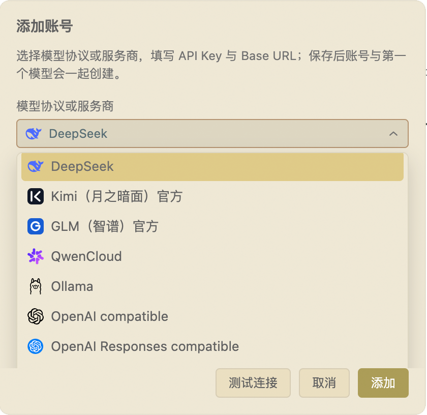

> **English: [README.en.md](./README.en.md) | 中文：本文档**


# KeepSeek：在VS Code 侧边栏，自由使用你的 AI 模型

> **多账户 · 多服务商 · 原生协议 · 缓存优化 · Cursor 式交互**

KeepSeek 是一个开源的 VS Code 编程智能体。它不把你的工作流绑定在某一家模型服务上：官方 DeepSeek、Kimi、GLM、QwenCloud，OpenAI Chat Completions / Responses 兼容服务、Anthropic Messages 兼容服务，以及本地 Ollama，都可以作为独立账号同时接入、集中管理、随时切换。

模型可以换，顺手的工作流不用换。KeepSeek 把 Cursor 式的上下文交互、面向长会话的缓存优化、专业的只读代码探索，以及必须由你确认的 DraftEdit，放进你已经熟悉的 VS Code。

- **多个账号同时在线**：个人、团队、代理、本地模型分开配置，一个账号可管理多个模型；
- **三条独立协议通道**：Chat Completions、OpenAI Responses、Anthropic Messages 各自原生流式处理，不用把所有服务商硬塞进同一种格式；
- **原生 DeepSeek 支持**：官方连接、模型发现、Thinking、工具调用、余额 / 用量与前缀缓存诊断形成完整体验；
- **为长会话优化**：稳定请求前缀、只增历史、受控压缩与按会话冻结的工具 schema，减少重复 token 和缓存失效；
- **像 Cursor 一样顺手**：侧边栏对话、右键选区、快捷键引用、文件 / 目录拖拽、终端与调试日志引用；
- **修改权始终在你手里**：Agent 只生成 DraftEdit，查看 Diff 并点击 Apply 后才会写入磁盘。

**开源软件 · MIT License · [GitHub](https://github.com/kmvdata/keepseek)**

---

## 一、多账户、多服务商：模型选择权回到你手里

一套编码工作流，不应该等于一份永久绑定的模型订阅。KeepSeek 把「账号」作为模型连接的基本单位：每个账号独立保存服务商 / API 协议、API Key、Base URL 和模型列表；同一个服务商可以添加多个账号，同一个账号也可以挂载多个模型。



你可以把官方账号、公司网关、低成本兼容服务和本地 Ollama 放在一起，按任务切换：快速问答用轻量模型，复杂重构切到强推理模型，敏感代码交给本地模型。聊天入口、上下文引用和安全确认方式始终不变。

### 支持的服务商与 API 类型

| 服务商 / API 类型 | 请求通道 | 适合场景与特色 |
|---|---|---|
| **DeepSeek 官方** | Chat Completions（原生适配） | 官方模型发现、Thinking、工具调用、余额 / 用量与前缀缓存诊断 |
| **Kimi 官方** | Chat Completions | 官方端点、模型发现与流式 Agent 调用 |
| **GLM 官方** | Chat Completions | 官方端点、模型发现与工具调用 |
| **QwenCloud** | Chat Completions compatible | 阿里云兼容端点与模型管理 |
| **OpenAI compatible** | Chat Completions | OpenAI、第三方网关、代理与自建兼容服务 |
| **OpenAI Responses compatible** | Responses API | 原生 Responses 输入项、函数调用与推理内容回放 |
| **Anthropic compatible** | Messages API | 原生 Messages 内容块、Thinking / signature 与工具回放 |
| **Ollama** | 本地 Chat Completions | 默认连接本机服务，可免 API Key 使用本地模型 |

兼容端点不提供模型列表也没有关系：KeepSeek 会保留上次成功缓存，你也可以手动添加模型 ID、上下文窗口与最大输出预算。

### 原生协议，不是「看起来兼容」

KeepSeek 在内部维护三条彼此独立的请求与流式解析通道：

- **Chat Completions**：服务 DeepSeek、Kimi、GLM、QwenCloud、Ollama 与通用 OpenAI 兼容端点；
- **OpenAI Responses**：保留 Responses API 的原生 input items、函数调用输出和推理回放；
- **Anthropic Messages**：按 Messages 协议发送认证与请求字段，原样保留 Thinking、signature、redacted data、`tool_use` / `tool_result` 的顺序。

在同一协议、账号与端点内继续对话时，Provider 原生状态可以保真回放。跨账号或跨协议切换时，用户可见的对话文本仍然保留；KeepSeek 会提示原生工具 / 推理块无法无损迁移的边界，避免悄悄伪造兼容性。

### 账号切换应该简单，也应该可靠

- 模型菜单聚合所有账号，并按账号分组展示；选中模型后，对话和摘要统一使用它所属账号的凭证；
- 相同协议、API Key 与 Base URL 的连接会复用已有账号，避免重复保存凭证；
- 模型刷新失败会继续使用本地缓存，不阻塞当前对话；
- 凭证只保存在 VS Code 扩展全局存储，不进入工作区，也不会进入 Git；
- 旧版 `keepseek.apiKey`、`keepseek.baseUrl` 与 `DEEPSEEK_API_KEY` 已停止读取，请在 KeepSeek 的账号管理中配置连接。

---

## 二、原生 DeepSeek 与缓存优化：这是强项，不是限制

KeepSeek 不再只属于 DeepSeek，但依然把 DeepSeek 的官方体验做深：独立官方来源、模型发现、Thinking 流式内容、工具调用、账户余额、用量与费用信息，以及服务端返回的缓存命中数据，都可以在同一套界面里工作。

更重要的是，KeepSeek 把「缓存能否持续命中」当作产品行为，而不是碰运气。Agent 长对话里，系统提示、工具定义和历史消息会在每轮重复出现；如果这些内容不断发生字节漂移，就会反复消耗输入 token。KeepSeek 为 DeepSeek 前缀缓存，也为其他服务商的提示缓存，建立了同一套缓存友好基础。

### 四个缓存友好原则

1. **请求前缀字节稳定**：静态 system 段不混入时间戳、随机 ID 或临时状态；项目指令、Skills 与上下文格式化结果按会话持久化复用。
2. **历史只增不改**：已经发送的 user / assistant 消息原样持久化，投影尽量 append-only，不在热会话中随意 trim、重排或重写中段历史。
3. **工具 schema 按会话冻结**：工具集合与顺序跨轮保持稳定；需要禁用工具时使用协议能力控制，而不是删除整个 tools 段。
4. **压缩是受控重置点**：长会话摘要低频触发、失败不阻塞主请求；热缓存优先保留，只有冷恢复、必要压缩或切换协议通道时才承担重置成本。

对官方 DeepSeek，这套设计直接提高多轮前缀复用的稳定性；对官方 Anthropic，KeepSeek 会在官方端点使用对应的 Prompt Caching 语义；对其他兼容服务，则以服务端真实返回的 usage / cache 数据为准，不虚构命中率或费用。

> 缓存友好不是一句口号。KeepSeek 用缓存字节稳定性与协议投影测试守护这些约束，避免一次普通改动让长会话突然变贵。

### 上下文压缩：不仅降低单价，也减少总量

缓存解决重复输入的成本，压缩解决上下文的体积。KeepSeek 的模型输入不是简单地把聊天记录全部倒进请求，而是由统一的 history projection 组织：

- 摘要只保留目标、决策、错误、文件路径、行段、函数名、完成项与待办；
- 历史中展开过的大段文件正文、日志和代码块不会永久反复携带；
- 模型需要细节时，通过只读工具重新读取当前文件，避免被旧代码误导；
- 首条需求、最新输入、用户纠错、关键错误 / 测试失败和 DraftEdit 结果受到保护；
- 自动压缩可选择 **70% 提前清理、80% 均衡、85% 缓存优先**，并按工作区保存。

结果是：长会话可以继续积累上下文，但 token 不必跟着聊天轮数无边界膨胀。

### 用量与缓存健康看得见

- 用量先按**账号 + 模型**归属，再区分主请求、摘要、重试、续接、子代理与后台任务；
- 实际请求、token 估算、窗口越界防护、压缩决策和 UI 展示共用同一套 Provider 投影；
- 服务商提供价格或余额能力时展示对应数据；无法可靠计价时明确显示「费用不可用」；
- 每轮 Run Details 可记录服务端真实返回的缓存命中 / 未命中 token、命中率与数据可用性；
- 协议、账号、端点、system prompt、tools schema 或历史投影发生变化时，缓存诊断会给出可能的失效原因。

---

## 三、保留 Cursor 的手感，不离开 VS Code

KeepSeek 住在 VS Code 侧边栏里。你可以一边看代码，一边把真正需要的上下文交给模型，不必切窗口，也不必在聊天框与编辑器之间反复复制粘贴。

### 上下文只给你想给的

- **编辑器选区**：右键或 `Cmd+L` / `Ctrl+Shift+L` 添加，保留文件路径、行号与列号；
- **文件与目录**：从 Explorer 右键添加，或直接拖进输入框生成引用 chip；
- **运行现场**：终端、Output 面板和 Debug Console 的选中内容可作为日志引用加入；
- **精确行段**：使用 `<path#L10-L20>`，只展开需要的部分，不把整份文件塞给模型；
- **外部内容**：工作区之外的文件先请求授权，再进入上下文。

### 不只是聊天，更是一套代码阅读工具

- 声明与引用优先使用 VS Code 语言服务，定位更准，也比反复灌入整文件更省 token；
- 工作区文本搜索、目录清单与行段读取全部只读，不越出工作区；
- 依赖、构建与 VCS 目录自动跳过，二进制、媒体、归档和超限文件不会进入上下文；
- Git 只提供 branch、status、diff、patch 和 commit message 建议，不 push，也不替你 commit；
- 模型按需重读当前文件，看到的是你刚刚修改后的代码，而不是几轮前的副本。

当 AI 写代码越来越快，KeepSeek 让你仍然能掌握架构、依赖和改动边界：让模型干活，也让人始终看得清全局。

任务变多时，让 AI 也学会“分工”。KeepSeek 支持隔离的“主模型 + 子代理”协作：主模型可把独立的调查、审查或待确认修改提案拆给多个受限子代理并行处理，每个子代理只带着明确的小任务出发，完成后只把精炼结论带回对话。子代理的中间推理与工具轨迹留在隔离会话中，不反复挤占主上下文——长对话因此更省 token、出结果更快，主模型也能腾出精力专注真正难的问题。子代理模型可在“账号管理”中全局固定，默认跟随主模型；子代理提交的修改仍需你统一审核确认，安全边界一分不变。架构、安全边界和 Profile 格式见 [SUBAGENTS.md](SUBAGENTS.md)。

---

## 四、安全修改：Agent 提议，你来决定

KeepSeek 把「能理解代码」和「能直接改盘」分开：

- **不静默写入**：create / modify / delete 只能生成 DraftEdit 并进入 ChangeSet；
- **先看 Diff，再 Apply**：你可以选择 Apply、Discard 或 Revert，只有点击 Apply 才会落盘；
- **删除双重确认**：高风险工具授权与 Apply 前删除确认缺一不可；
- **防止覆盖新内容**：草案生成后文件若发生变化，删除或危险写入会被拒绝；
- **脏编辑器保护**：未保存内容不会被后台修改覆盖；
- **只读工具有边界**：Agent 探索不越出工作区，外部文件必须显式授权。

这不是多一步操作，而是把最终决定权留在正确的位置。

---

## 五、为真实工程准备的 Agent 能力

### Skills 与项目指令

KeepSeek 可发现工作区 `.agents` 与 `~/.codex/skills` 中的 Codex-compatible Skills。用 `/skills` 浏览、用 `$` 引用，也可以通过 `/create-skill` 生成草案。项目 `AGENTS.md`、激活的 Skills 和上下文文件经过统一预算与去重后进入会话；Skill 中的脚本只会被识别，永不自动执行。

### 长任务与会话管理

- 运行中可随时停止推理或工具循环；
- 首块响应前的可重试错误使用指数退避；
- 会话按项目保存，可收藏、重命名、筛选、复制到当前项目或批量删除；
- 后台执行按会话串行，避免并发改写历史与缓存前缀；
- 模型切换会检查目标上下文窗口与协议回放边界，必要时先给出本地确认。

### 子代理与并行

主模型可以把独立的调查、审查或提案委托给受限子代理并行执行。子代理运行在隔离会话中：只收到自包含任务、Profile、项目 `AGENTS.md` 与受限工具集，中间推理与工具轨迹留在隔离会话，完成后仅把精炼结论带回主上下文。

- **内置 Profile**：`research`（只读调查）、`review`（只读审查）与 `proposal`（准备待确认修改提案）；Skill 也可以定义专用的子代理 Profile；
- **安全边界不变**：只读子代理不越出工作区；提案子代理只能准备 DraftEdit / DraftRun，不能 Apply、批准或执行命令；并行提案需预先声明路径并检测冲突，合并前还会校验产出；
- **模型可固定**：子代理模型可在账号管理中全局设置，默认跟随主模型，也可固定为指定模型；固定模型缺失或不可用时委托会明确失败，不会悄悄回退；
- **用量独立统计**：子代理的 token 消耗归属 `subagent` 来源，可在 Usage details 中查看，包含隔离中间上下文的节省估算与最近运行统计；
- **受控调度**：子代理并发、深度与每轮数量有硬限制，停止主运行会级联取消排队与执行中的子代理。

架构、安全边界、Profile 格式与限制详见 [SUBAGENTS.md](SUBAGENTS.md)。

### 受控验证与修复

Agent 只能运行固定的 `compile` / `lint` / `test` 验证。失败后读取 Problems、准备修复 DraftEdit，并等待你确认；修复未 Apply 之前不会擅自开始下一轮验证。

---

## 六、KeepSeek 适合谁

- **同时使用多个模型服务的人**：希望比较质量、速度和成本，又不想维护多套插件工作流；
- **BYOK 与团队开发者**：需要把个人账号、团队网关、代理和本地模型清晰隔离；
- **DeepSeek 官方用户**：想要原生 Thinking、余额 / 用量和缓存优化，而不放弃未来切换模型的自由；
- **OpenAI Responses / Anthropic Messages 用户**：重视原生工具与推理块回放，不接受低保真的协议转换；
- **本地模型用户**：希望把 Ollama 和云端模型放在同一个 VS Code 入口；
- **重度 Agent 用户**：长对话多、文件和日志上下文大，关心 token、缓存和上下文健康；
- **架构负责人、Reviewer 与新成员**：需要语义导航、只读探索和可审查修改来掌握项目全貌。

---

## 七、快速上手

```bash
# 1. 构建并安装本地 VSIX
bun run package
code --install-extension keepseek-<version>.vsix

# 或一键打包、卸载旧版并安装新版
bun run reinstall:vsix
```

```text
# 2. 在 VS Code 中打开
KeepSeek: Open Chat
```

```text
# 3. 打开 KeepSeek 的“账号管理”
选择 DeepSeek / Kimi / GLM / QwenCloud / Ollama / OpenAI compatible /
OpenAI Responses compatible / Anthropic compatible，填写 API Key 与 Base URL，添加模型。
```

然后选中一段代码，按 `Cmd+L` / `Ctrl+Shift+L`（或右键添加到 KeepSeek），开始第一次对话。以后切换账号或模型，交互方式不需要重新学习。

---

## 八、常用配置

| 配置键 | 默认值 | 说明 |
|---|---:|---|
| `keepseek.selectedSourceId` + `keepseek.selectedModelId` | `""` | 按工作区保存当前选择的账号来源与模型 |
| `keepseek.thinkingEnabled` | `true` | 为支持的模型启用 Thinking |
| `keepseek.reasoningEffort` | `high` | Thinking 强度：`high` / `max`，按模型能力适配 |
| `keepseek.compressionThreshold` | `balanced` | `aggressive` 70% / `balanced` 80% / `cache` 85% |
| `keepseek.slimToolModeEnabled` | `false` | 更小的动态工具集；默认关闭以保持 tools schema 稳定 |
| `keepseek.promptCacheTtlMinutes` | `1440` | 保守的 Provider 提示缓存冷却边界 |
| `keepseek.maxFileBytes` | `200000` | 单个引用或工作区文本文件的最大读取字节 |
| `keepseek.maxWorkspaceToolFiles` | `2000` | 只读列表与搜索最多枚举的候选文件数 |
| `keepseek.context.totalBudgetTokens` | `32000` | 项目指令、Skills、Memory 与上下文文件的共享预算 |

---

## 九、维护者命令

```bash
bun run compile
bun run lint
bun run build:test
bun run test
bun run package:market
```

发布请使用 `bun run package:market`。它会清理并重新编译、带运行时依赖打包，再验证 VSIX 的依赖与入口；不要裸跑 `npx vsce package --no-dependencies`。

---

## 十、更多资料

- [缓存命中优化技术详解](./doc/cache_keepseek.md)
- [Agent 运行时工作流](./doc/keepseek-agent-runtime-workflow.md)
- [API Payload 参考](./doc/keepseek-api-payload-reference.md)
- [文件引用规范](./doc/keepseek-file-reference-spec.md)
- [项目源码](https://github.com/kmvdata/keepseek)

---

## 致谢

KeepSeek 早期的上下文与缓存设计曾受到 **Reasonix** 启发，在此致谢。

---

*KeepSeek in one line: an open-source VS Code sidebar coding agent for multiple accounts and providers, with native DeepSeek, OpenAI Responses and Anthropic Messages support, cache-aware long conversations, Cursor-like context interactions, and review-before-apply edits.*
