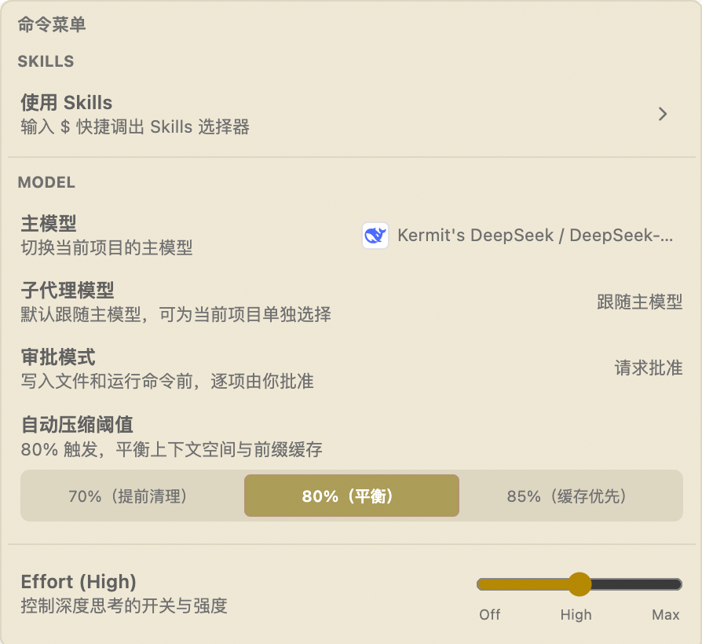
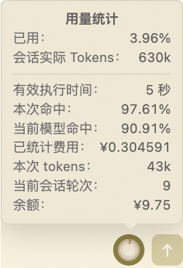
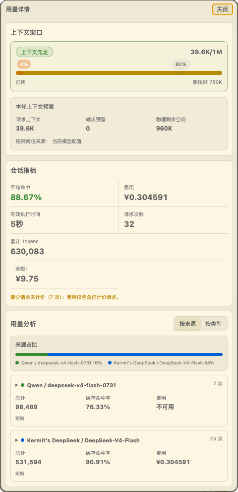

> **English: [README.en.md](./README.en.md) | 中文：本文档**

<p align="center">
  
</p>

# KeepSeek

## 一、把你选择的模型，变成真正能干活的编程 Agent

**KeepSeek 是一个开源的 VS Code 侧边栏编程 Agent：模型由你选择，上下文由你掌控，修改与命令由你决定是否执行。**

它把多家 AI 服务、项目上下文、代码探索、文件修改和命令执行放进同一套工作流。你不必在浏览器、终端和编辑器之间来回复制，也不必为了换模型重新适应一套工具。

KeepSeek 最实用的地方，可以归结为四件事：

- **不绑定模型服务**：DeepSeek、Kimi、GLM、QwenCloud、OpenAI、Anthropic 兼容服务和本地 Ollama 可以同时接入，按任务自由切换；
- **理解你正在写的项目**：选区、文件、目录、终端输出和调试日志都能直接成为对话上下文，Agent 也能按需搜索和重读代码；
- **能动手，但不越权**：修改先给你看 Diff，命令先展示完整内容；是否应用或执行，由当前审批模式决定；
- **适合长任务**：会话按项目保存，支持 Skills、子代理协作、上下文压缩和用量统计，让复杂任务更容易持续推进。

如果你想保留自己的 API、模型和成本选择权，又希望在 VS Code 里获得一套完整的 Agent 工作流，KeepSeek 就是为此而做。

**开源软件 · MIT License · [GitHub](https://github.com/kmvdata/keepseek)**

---

## 二、从接入模型到完成任务

### 1. 一个入口管理所有模型

KeepSeek 以“账号”管理模型连接。个人账号、团队网关、第三方兼容服务和本地模型可以分开配置；一个账号也可以管理多个模型。切换模型时，对话入口、上下文引用和安全确认方式都不变。


目前支持官方 DeepSeek、Kimi、GLM、QwenCloud，OpenAI Chat Completions / Responses 兼容服务、Anthropic Messages 兼容服务，以及本地 Ollama。各协议独立处理流式响应、工具调用和推理内容；兼容端点没有模型列表时，也可以手动添加模型。

API Key 只保存在 VS Code 扩展的全局存储中，不写入工作区或 Git。

### 2. 把真正相关的上下文交给 AI

KeepSeek 常驻 Secondary Sidebar。打开 `KeepSeek: Open Chat`、选择账号和模型后，就可以直接围绕当前项目提问：

- 在编辑器中选中代码，通过右键或 `Cmd+L` / `Ctrl+Shift+L` 加入对话；
- 从 Explorer 添加文件或目录，也可以直接拖入输入框；
- 引用终端、Output 面板或 Debug Console 中的运行信息；
- 用 `<path#L10-L20>` 只提供需要的行段；
- 让 Agent 使用只读工具搜索文本、查看目录、查找声明与引用，并读取 Git 状态和 Diff。

模型需要细节时会重新读取当前文件，避免长期依赖几轮之前的旧代码。工作区外的文件必须先获得授权，二进制、媒体、归档和超限内容不会被当作文本上下文读取。

项目中的 `AGENTS.md` 可以约定长期生效的开发规则；Codex-compatible Skills 则可以封装特定任务的流程。你可以通过命令菜单浏览 Skills，或在输入框中键入 `$` 快速选择。

### 3. 让 Agent 修改和验证，但保留清晰边界

KeepSeek 把“提出改动”和“真正执行”分开：

- 文件创建、修改和删除先生成待确认改动，你可以查看 Diff，再选择 Apply、Discard 或 Revert；
- 任意命令先生成完整的运行提案，明确展示程序、参数、工作目录、环境与风险；
- 删除、文件冲突、未保存编辑器和未信任工作区都有额外保护；
- 内置验证只运行固定的 `compile`、`lint` 和 `test`，失败后可以继续准备修复并再次审核。

因此，Agent 可以完成真实工程任务，但不会在你看不到的地方静默改写文件或执行命令。

### 4. 用命令菜单控制当前任务

点击输入框下方的 **`/` 按钮**，即可打开命令菜单。你可以在这里调用 Skills、切换主模型和子代理模型、调整审批模式与自动压缩阈值，以及控制 Thinking 强度。

<p align="center">
  
</p>

审批模式分为三档：

- **请求批准**（默认）：每次写入文件或执行命令前都由你确认；
- **模型审批**：由隔离、无工具的子代理模型逐项审查，适合需要持续运行的长任务，审查模型可以拒绝风险操作；
- **自动批准**：不经过模型审查，按你的委托自动处理当前项目中的任务，效率最高，风险也最高。

选中的审批模式按项目保存，在该项目中新建或切换会话时会继续使用。

切换到自动模式不会关闭工作区信任、文件冲突、脏编辑器等硬性检查。任务运行中可以随时停止，或切回“请求批准”撤销后续自动操作。

### 5. 让长任务持续推进，也看得清成本

会话按项目保存，支持收藏、重命名、筛选和复制。复杂任务可以交给多个受限子代理并行调查、审查或准备修改提案；子代理的中间过程保持隔离，只把精炼结果交回主会话，最终改动仍沿用相同的审核边界。详细机制见 [SUBAGENTS.md](SUBAGENTS.md)。

长会话会在保留关键目标、决策、错误和待办的同时压缩过期上下文，并尽量维持提示缓存命中。你可以选择提前清理、均衡或缓存优先，不需要手动计算上下文还能容纳多少内容。

将鼠标悬停在输入区底部的用量指示器上，可以快速查看上下文占用、会话 token、缓存命中率、费用、轮次与余额：

<p align="center">
  
</p>

点击指示器可打开“用量详情”，继续查看上下文窗口、压缩位置、会话指标，以及按账号、模型、请求来源或类型拆分的用量：

<p align="center">
  
</p>

服务商能够可靠返回价格、余额或缓存数据时，KeepSeek 会如实展示；数据不可用时会明确标注，不估算成看似精确的结果。

---

## 三、开发、打包与项目资料

### 本地开发

项目要求 VS Code `^1.98.0`，常用开发命令统一通过 Bun 运行：

```bash
bun install
bun run compile
```

用 VS Code 打开仓库后按 `F5`，即可启动 Extension Development Host 调试扩展。修改源码后，可执行以下检查：

```bash
bun run lint
bun run build:test
bun run test
```

核心代码按职责拆分：`src/agent/` 负责任务编排与模型协议，`src/context/` 负责引用展开，`src/edits/` 与 `src/runs/` 负责待确认修改和命令，`src/sessions/` 负责会话持久化，`src/webview/` 负责侧边栏界面。维护前请先阅读 [AGENTS.md](AGENTS.md)，其中记录了缓存、安全和改动影响面的项目约定。

### 打包与本机验证

生成普通 VSIX：

```bash
bun run package
```

生成市场发布包：

```bash
bun run package:market
```

`package:market` 会清理旧产物、重新编译、带上运行时依赖，并检查 VSIX 的依赖和入口。请勿使用 `npx vsce package --no-dependencies`，否则发布包可能缺少运行时依赖。

在本机一键重新打包、卸载旧版并安装新版：

```bash
bun run reinstall:vsix
```

### 维护资料

- [Agent 运行时工作流](./doc/keepseek-agent-runtime-workflow.md)
- [缓存命中优化技术详解](./doc/cache_keepseek.md)
- [API Payload 参考](./doc/keepseek-api-payload-reference.md)
- [文件引用规范](./doc/keepseek-file-reference-spec.md)
- [子代理架构与 Profile](./SUBAGENTS.md)

### 致谢

KeepSeek 早期的上下文与缓存设计曾受到 **Reasonix** 启发，在此致谢。

项目以 [MIT License](./LICENSE) 开源，欢迎提交 Issue、建议与改进。
